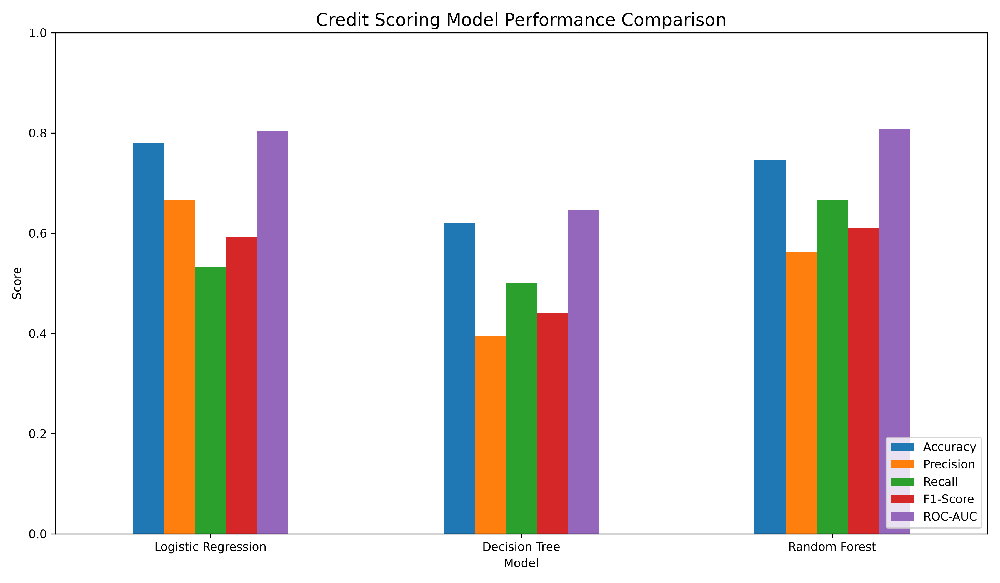
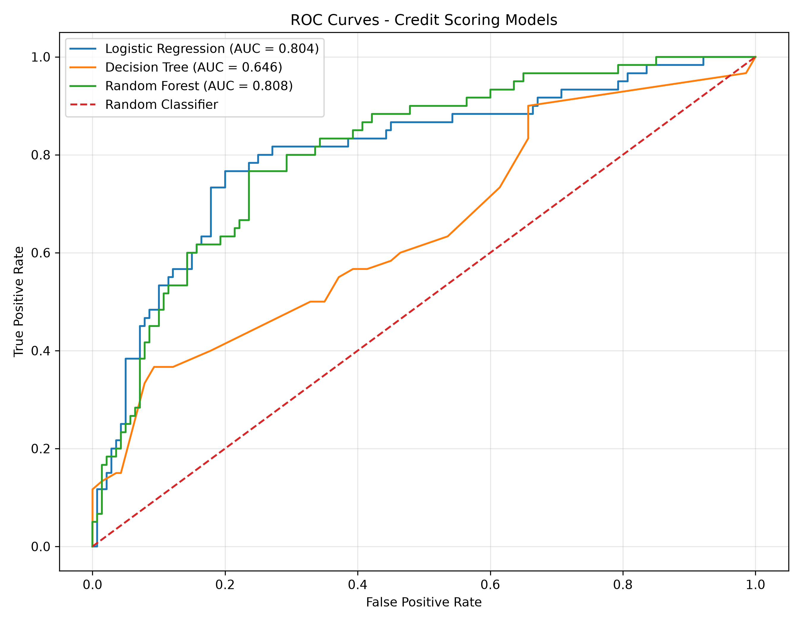
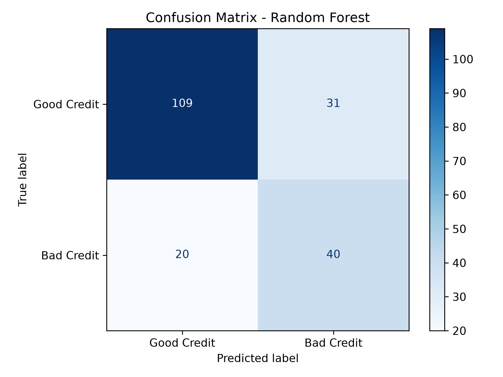

## CodeAlpha Internship

**Name:** Mohammed Sadiya Tabassum  
**Student ID:** CA/DF1/210263  
**Internship Domain:** Machine Learning  
**Task Name:** Task 1 - Credit Scoring Model

---

# 💳 Credit Risk Prediction System

A Machine Learning based Credit Scoring System developed as part of my **CodeAlpha Machine Learning Internship**.

The application predicts whether an applicant represents a **Good Credit Risk** or **Bad Credit Risk** based on financial and personal information.

The project includes complete data preprocessing, model training, model comparison, evaluation, and an interactive Streamlit web application.

---

## 🌐 Live Demo

Try the deployed Credit Risk Prediction System:

**[Launch Live Application](https://codealphacreditscoringmodel-nptenypou7vaheskdmlzam.streamlit.app/)**

## 🎯 Project Objective

The objective of this project is to predict an individual's creditworthiness using historical financial data.

The system evaluates multiple classification algorithms and selects the best-performing model based on ROC-AUC score.

---

## 📊 Dataset

This project uses the **Statlog German Credit Dataset** from the UCI Machine Learning Repository.

The dataset contains:

- 1,000 credit applicants
- 20 input features
- 1 target variable
- 700 Good Credit cases
- 300 Bad Credit cases

The features include information such as:

- Credit amount
- Loan duration
- Credit history
- Savings account
- Employment duration
- Age
- Housing
- Existing credits
- Property information
- Installment rate

---

## 🧠 Machine Learning Models

Three classification algorithms were trained and evaluated:

1. Logistic Regression
2. Decision Tree
3. Random Forest

The same training/testing split and preprocessing pipeline were used to ensure a fair comparison.

---

## ⚙️ Machine Learning Pipeline

The project follows the workflow:

Data Collection  
↓  
Data Exploration  
↓  
Data Preprocessing  
↓  
Categorical Feature Encoding  
↓  
Numerical Feature Scaling  
↓  
Train-Test Split  
↓  
Model Training  
↓  
Model Evaluation  
↓  
Model Comparison  
↓  
Best Model Selection  
↓  
Streamlit Deployment

Categorical variables are processed using **One-Hot Encoding**, while numerical features are standardized using **StandardScaler**.

---

## 📈 Model Performance

| Model | Accuracy | Precision | Recall | F1-Score | ROC-AUC |
|---|---:|---:|---:|---:|---:|
| Logistic Regression | 0.7800 | 0.6667 | 0.5333 | 0.5926 | 0.8040 |
| Decision Tree | 0.6200 | 0.3947 | 0.5000 | 0.4412 | 0.6465 |
| Random Forest | 0.7450 | 0.5634 | 0.6667 | 0.6107 | **0.8080** |

### 🏆 Selected Model: Random Forest

Random Forest achieved the highest **ROC-AUC score of 0.808**.

Although Logistic Regression achieved slightly higher overall accuracy, Random Forest provided better recall for identifying bad-credit applicants and the highest ROC-AUC score.

---

## 📊 Model Comparison

---

## 📈 ROC Curve

The ROC curve compares the ability of the three models to distinguish between good-credit and bad-credit applicants.

---

## 🔢 Confusion Matrix

For the Random Forest model:

- 109 Good Credit applicants were correctly classified.
- 40 Bad Credit applicants were correctly classified.
- 31 Good Credit applicants were classified as Bad Credit.
- 20 Bad Credit applicants were classified as Good Credit.

---

## 💻 Web Application

An interactive web application was developed using **Streamlit**.

Users can enter applicant information such as:

- Credit amount
- Loan duration
- Credit history
- Savings
- Employment duration
- Age
- Housing status
- Existing credits

The application then displays:

- Good Credit Risk / Bad Credit Risk prediction
- Good Credit probability
- Bad Credit probability
- Risk probability indicator

---

## 🛠️ Technologies Used

- Python
- Pandas
- NumPy
- Scikit-learn
- Matplotlib
- Joblib
- Streamlit
- VS Code
- Git & GitHub

---

## 📁 Project Structure

    CodeAlpha_CreditScoringModel/
    │
    ├── data/
    │   └── german.data
    │
    ├── models/
    │   └── credit_model.pkl
    │
    ├── outputs/
    │   ├── confusion_matrix.png
    │   ├── model_comparison.png
    │   ├── model_results.csv
    │   └── roc_curve.png
    │
    ├── src/
    │   ├── explore_data.py
    │   └── train_model.py
    │
    ├── app.py
    ├── requirements.txt
    ├── .gitignore
    └── README.md

---

## 🚀 How to Run the Project

### 1. Clone the repository

    git clone <repository-url>

### 2. Navigate to the project directory

    cd CodeAlpha_CreditScoringModel

### 3. Create a virtual environment

    python -m venv .venv

### 4. Activate the environment on Windows

    .venv\Scripts\activate

### 5. Install dependencies

    pip install -r requirements.txt

### 6. Train the model

    python src/train_model.py

### 7. Run the Streamlit application

    python -m streamlit run app.py

The application will open in your browser.

---

## 📌 Key Features

- Real-world credit risk dataset
- Automated preprocessing pipeline
- Categorical feature encoding
- Feature scaling
- Multiple ML model comparison
- Precision, Recall and F1 evaluation
- ROC-AUC evaluation
- Confusion matrix visualization
- ROC curve visualization
- Automatic best-model selection
- Saved ML pipeline
- Interactive Streamlit interface
- Credit-risk probability prediction

---

## ⚠️ Disclaimer

This project was developed for educational and internship purposes.

The predictions produced by this application should **not** be used for actual lending, banking, credit approval, or financial decision-making.

---

## 👩‍💻 Internship

**Machine Learning Internship — CodeAlpha**

### Task 1: Credit Scoring Model

Developed as part of the Machine Learning Internship task requirements.