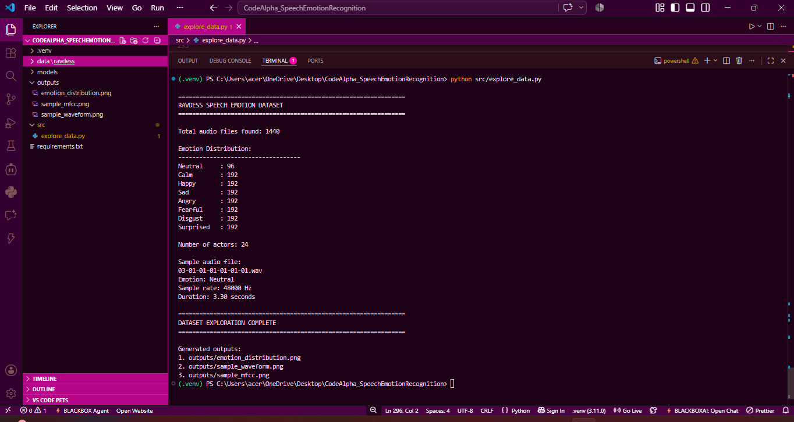
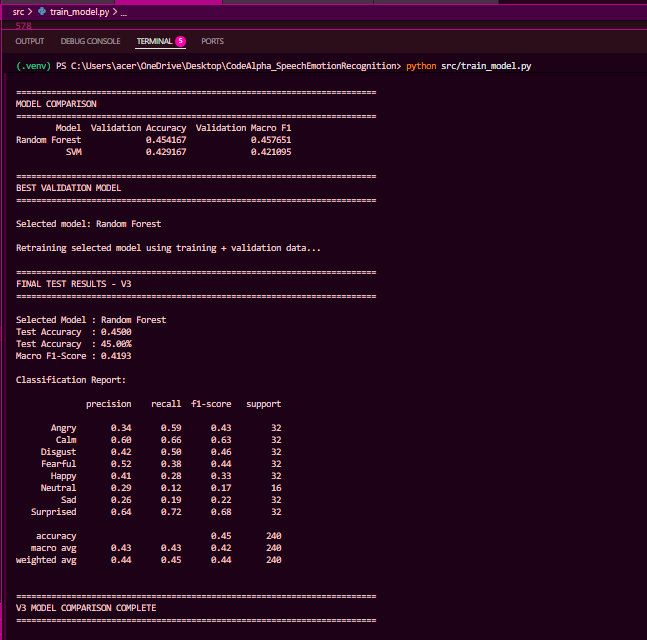
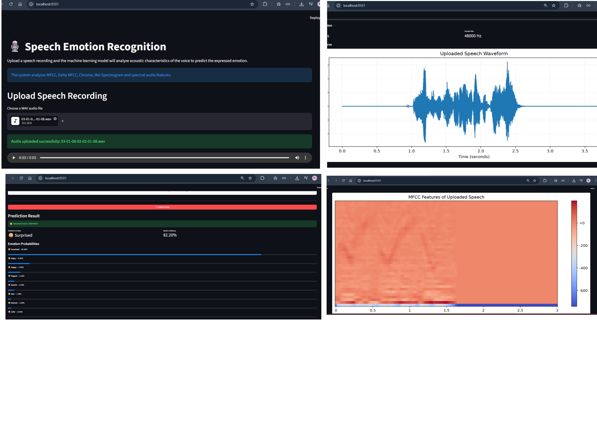
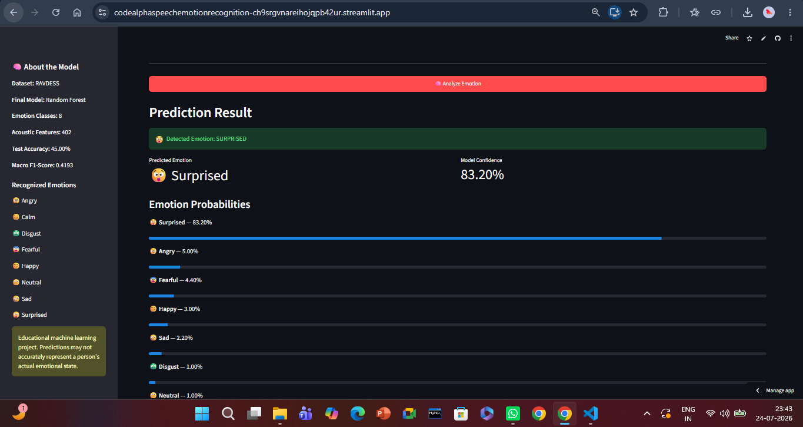
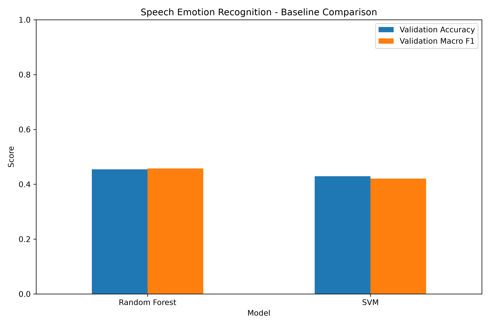
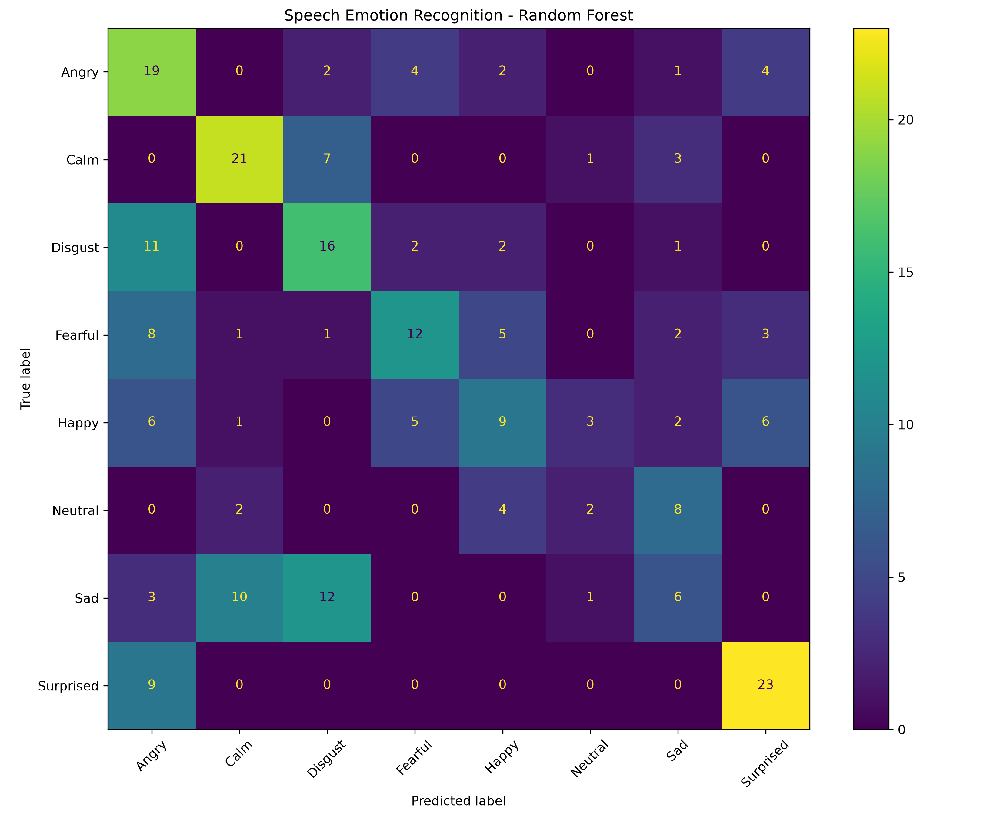

## CodeAlpha Internship

**Name:** Mohammed Sadiya Tabassum  
**Student ID:** CA/DF1/210263  
**Internship Domain:** Machine Learning  
**Task Name:** Task 2 - Emotion Recognition from Speech

---

# 🎙️ Speech Emotion Recognition System

A Machine Learning project developed as part of the **CodeAlpha Machine Learning Internship**.

The application analyzes speech recordings and predicts the emotion expressed by the speaker using acoustic audio features and machine learning.

The system supports eight emotion classes:

- 😠 Angry
- 😌 Calm
- 🤢 Disgust
- 😨 Fearful
- 😊 Happy
- 😐 Neutral
- 😢 Sad
- 😲 Surprised

---

## 🔗 Project Links

🌐 **Live Demo:** [Speech Emotion Recognition App](https://codealphaspeechemotionrecognition-ch9srgvnareihojqpb42ur.streamlit.app/)

💻 **GitHub Repository:** [CodeAlpha Speech Emotion Recognition](https://github.com/scarletsiren50-art/CodeAlpha_SpeechEmotionRecognition)

---

## 📌 Project Overview

Speech Emotion Recognition (SER) aims to identify emotional information from speech signals.

This project uses the **RAVDESS (Ryerson Audio-Visual Database of Emotional Speech and Song)** dataset and extracts acoustic characteristics from speech recordings.

Multiple approaches were explored during development. The final system uses a **Random Forest classifier**, selected after comparison with an SVM model because it achieved better validation performance.

The trained model is integrated into an interactive **Streamlit web application**, allowing users to upload WAV recordings and analyze the predicted emotion.

---

## ✨ Features

- Upload `.wav` speech recordings
- Audio playback directly in the application
- Speech waveform visualization
- Automatic acoustic feature extraction
- Emotion prediction across 8 classes
- Prediction confidence
- Probability distribution across all emotions
- MFCC visualization
- Interactive Streamlit interface

---

## 📊 Dataset

The project uses the **RAVDESS speech dataset**.

### Dataset Statistics

| Property | Value |
|---|---:|
| Audio recordings | 1,440 |
| Actors | 24 |
| Emotion classes | 8 |
| Audio format | WAV |

### Emotion Distribution

| Emotion | Recordings |
|---|---:|
| Neutral | 96 |
| Calm | 192 |
| Happy | 192 |
| Sad | 192 |
| Angry | 192 |
| Fearful | 192 |
| Disgust | 192 |
| Surprised | 192 |

---

## 🎵 Audio Feature Extraction

Each recording is preprocessed and converted into a **402-dimensional acoustic feature vector**.

Features include:

- MFCC
- First-order MFCC Delta
- Second-order MFCC Delta
- Chroma
- Mel Spectrogram
- Zero Crossing Rate
- RMS Energy
- Spectral Centroid
- Spectral Bandwidth
- Spectral Rolloff

Silence trimming and fixed-length audio preprocessing are applied before feature extraction.

---

## 🧠 Model Development

Different modeling approaches were explored during development.

Initial neural-network experiments showed poor generalization, so the feature extraction and evaluation pipeline was redesigned.

The final version compares:

1. Random Forest
2. Support Vector Machine (SVM)

A **speaker-independent split** was used so that speakers in the test set were not used for model training.

### Dataset Split

| Split | Actors | Samples |
|---|---|---:|
| Training | 1–16 | 960 |
| Validation | 17–20 | 240 |
| Testing | 21–24 | 240 |

This provides a more challenging evaluation of how the model performs on unseen speakers.

---

## 📈 Model Comparison

| Model | Validation Accuracy | Validation Macro F1 |
|---|---:|---:|
| Random Forest | **45.42%** | **0.4577** |
| SVM | 42.92% | 0.4211 |

Random Forest achieved the strongest validation performance and was therefore selected as the final model.

---

## 🏆 Final Model Performance

The selected Random Forest model was retrained using the training and validation data and evaluated on the held-out test actors.

| Metric | Result |
|---|---:|
| Test Accuracy | **45.00%** |
| Macro F1 Score | **0.4193** |

The model showed particularly strong recognition for **Surprised** and **Calm** speech in the held-out test set.

---

## 🖼️ Project Outputs

### Dataset Exploration



### Model Training Results



### Speech Emotion Recognition Application



### Deployed Streamlit Application



### Model Comparison



### Confusion Matrix



---

## ⚙️ Project Structure

```text
CodeAlpha_SpeechEmotionRecognition/
│
├── data/
│   └── ravdess/
│
├── models/
│   ├── emotion_model_v3.pkl
│   └── label_encoder_v3.pkl
│
├── outputs/
│   ├── 01_dataset_exploration.png
│   ├── 02_model_training_results.png
│   ├── 03_emotion_prediction_app.png
│   ├── baseline_model_comparison.png
│   ├── baseline_model_comparison.csv
│   ├── classification_report_v3.csv
│   ├── confusion_matrix_v3.png
│   └── model_metrics_v3.csv
│
├── src/
│   ├── explore_data.py
│   ├── extract_features.py
│   └── train_model.py
│
├── app.py
├── requirements.txt
├── .gitignore
└── README.md
```

---

## 🚀 Running the Project Locally

### 1. Clone the repository

```bash
git clone <your-repository-url>
cd CodeAlpha_SpeechEmotionRecognition
```

### 2. Create a virtual environment

```bash
python -m venv .venv
```

### 3. Activate the virtual environment

#### Windows PowerShell

```powershell
.venv\Scripts\Activate.ps1
```

### 4. Install dependencies

```bash
pip install -r requirements.txt
```

### 5. Start the Streamlit application

```bash
python -m streamlit run app.py
```

Open the local Streamlit URL displayed in the terminal.

---

## 🔄 Machine Learning Pipeline

```text
RAVDESS Speech Dataset
        ↓
Audio Preprocessing
        ↓
Silence Trimming
        ↓
Acoustic Feature Extraction
        ↓
402 Audio Features
        ↓
Speaker-Independent Dataset Split
        ↓
Random Forest vs SVM
        ↓
Model Selection
        ↓
Random Forest
        ↓
Held-Out Speaker Evaluation
        ↓
Streamlit Web Application
```

---

## 🛠️ Technologies Used

- Python
- NumPy
- Pandas
- Librosa
- Scikit-learn
- Matplotlib
- Joblib
- Streamlit

---

## ⚠️ Limitations

Speech emotion recognition is a challenging task because emotional expression varies between speakers, accents, recording environments and speaking styles.

The model was trained using acted emotional speech from the RAVDESS dataset. Therefore, performance on everyday real-world recordings may differ from its performance on the dataset.

The application is intended for **educational and demonstration purposes only** and should not be used to make decisions about a person's emotional or psychological state.

---

## 🔮 Future Improvements

Potential improvements include:

- Training with larger and more diverse speech emotion datasets
- Audio data augmentation
- Hyperparameter optimization
- Deep learning architectures such as CNN, LSTM or CNN-LSTM
- Combining multiple speech emotion datasets
- Real-time microphone emotion recognition
- Improved robustness to background noise

---

## 👩‍💻 Internship Project

This project was developed as part of the **CodeAlpha Machine Learning Internship**.

**Task:** Emotion Recognition from Speech

The objective was to develop a system capable of recognizing human emotions from speech using audio processing and machine learning techniques.

---

## 📜 Disclaimer

This project is intended for educational purposes. Machine-learning predictions represent patterns learned from the training dataset and should not be interpreted as definitive assessments of a person's actual emotional state.