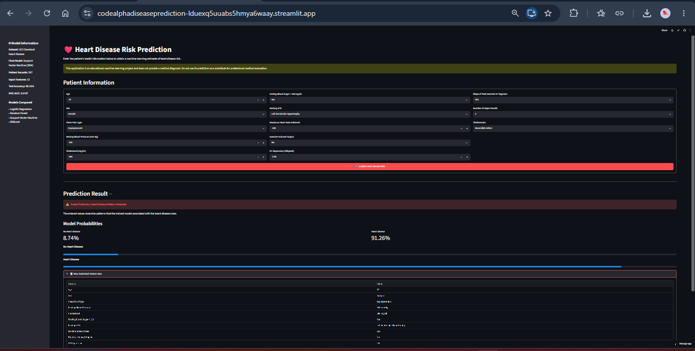
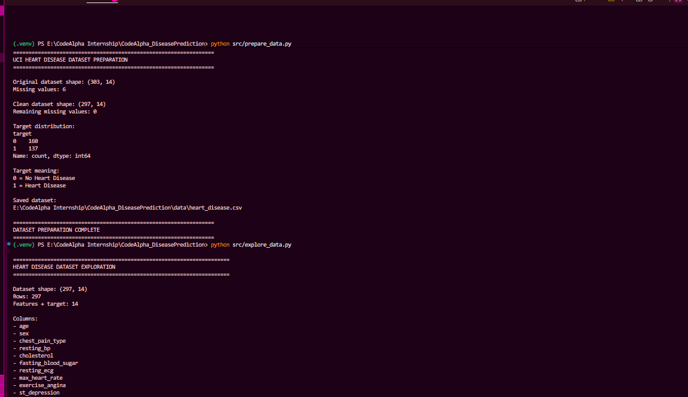
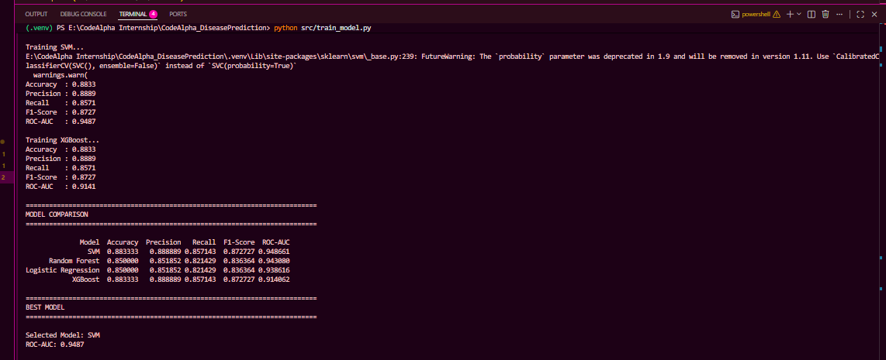
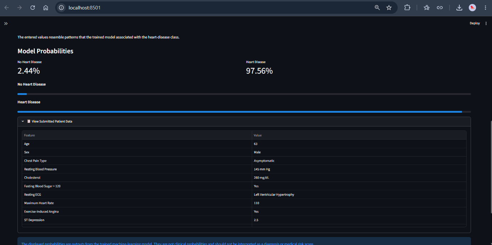
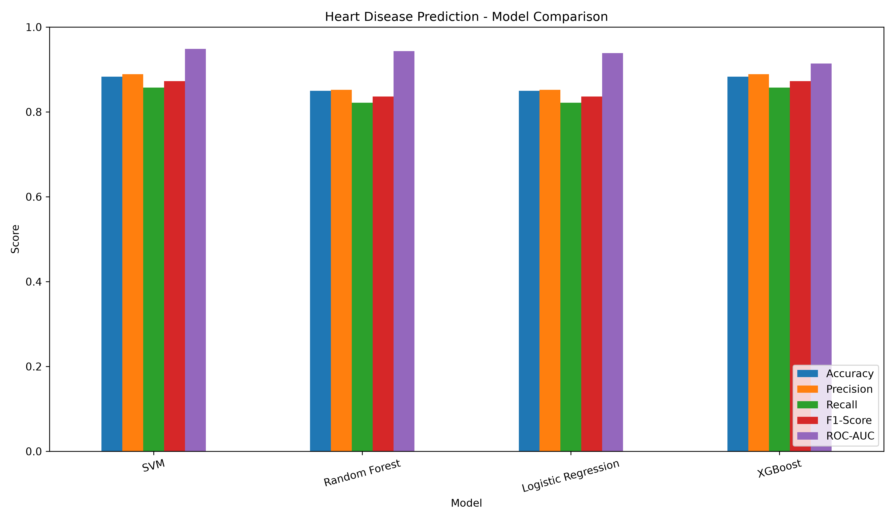
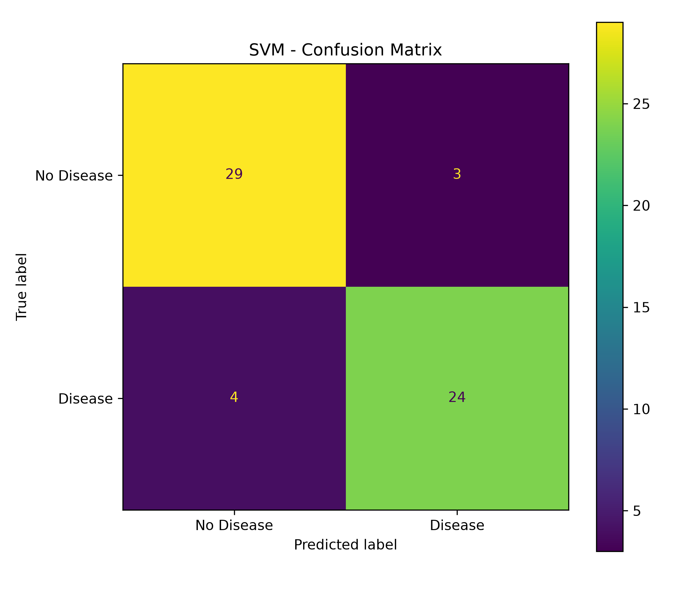
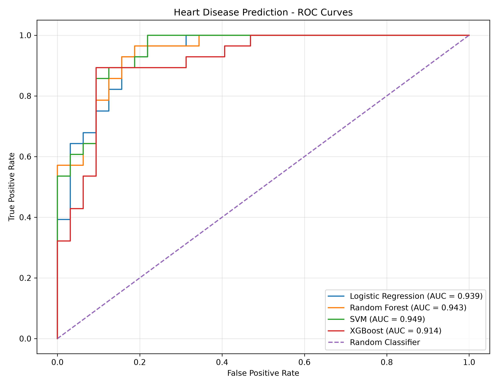

## CodeAlpha Internship

**Name:** Mohammed Sadiya Tabassum  
**Student ID:** CA/DF1/210263  
**Internship Domain:** Machine Learning  
**Task Name:** Disease Prediction from Medical Data

---

# ❤️ Heart Disease Prediction System

A machine learning application that predicts whether patient health information resembles patterns associated with heart disease using the **UCI Cleveland Heart Disease Dataset**.

The project compares multiple classification algorithms and deploys the best-performing model through an interactive **Streamlit web application**.

---

## 🌐 Live Application

The Heart Disease Prediction System is deployed using Streamlit Community Cloud.

**Live Demo:**  
[Disease Prediction System](https://codealphadiseaseprediction-lduexq5uuabs5hmya6waay.streamlit.app)

---

## 🚀 Deployed Application



---

## 📌 Project Overview

The objective of this project is to build a machine learning system for disease prediction using structured medical data.

For this implementation, the **UCI Cleveland Heart Disease Dataset** was used. Patient attributes such as age, cholesterol, resting blood pressure, maximum heart rate, chest pain type, and other clinical features are processed by classification models to predict the target class.

Four machine learning algorithms were evaluated:

- Logistic Regression
- Random Forest
- Support Vector Machine (SVM)
- XGBoost

The **Support Vector Machine (SVM)** achieved the highest ROC-AUC score and was selected as the final model.

---

## ✨ Features

- Patient health information input
- 13 medical input features
- Automated data preprocessing
- Numerical feature scaling
- Categorical feature encoding
- Comparison of four classification algorithms
- Automatic best-model selection
- Heart disease class prediction
- Model probability visualization
- Interactive Streamlit interface
- Submitted patient-data summary
- Model performance visualizations

---

## 📊 Dataset

The project uses the **UCI Cleveland Heart Disease Dataset**.

After removing records containing missing values, the cleaned dataset contains:

| Property | Value |
|---|---:|
| Patient Records | 297 |
| Input Features | 13 |
| Target | 1 |
| Total Columns | 14 |
| Missing Values | 0 |
| Duplicate Rows | 0 |

### Target Distribution

| Class | Patients |
|---|---:|
| No Heart Disease | 160 |
| Heart Disease | 137 |

The target was converted into binary classification:

```text
0 = No Heart Disease
1 = Heart Disease
```

---

## 🩺 Input Features

The model uses the following patient attributes:

1. Age
2. Sex
3. Chest Pain Type
4. Resting Blood Pressure
5. Cholesterol
6. Fasting Blood Sugar
7. Resting ECG
8. Maximum Heart Rate
9. Exercise-Induced Angina
10. ST Depression
11. ST Slope
12. Number of Major Vessels
13. Thalassemia

---

## ⚙️ Data Preprocessing

The preprocessing pipeline separates numerical and categorical variables.

### Numerical Features

Numerical variables are standardized using **StandardScaler**.

These include:

- Age
- Resting Blood Pressure
- Cholesterol
- Maximum Heart Rate
- ST Depression

### Categorical Features

Categorical variables are transformed using **OneHotEncoder**.

The complete preprocessing pipeline is stored together with the final classifier, allowing the Streamlit application to process new inputs using the same transformations applied during model training.

---

## 🧠 Machine Learning Models

Four classification algorithms were trained and evaluated:

### 1. Logistic Regression

A linear classification algorithm that estimates the probability of a binary outcome.

### 2. Random Forest

An ensemble learning algorithm that combines predictions from multiple decision trees.

### 3. Support Vector Machine

A classification algorithm that finds a decision boundary between classes. An RBF kernel was used in this project.

### 4. XGBoost

A gradient-boosted tree algorithm designed to combine multiple sequential decision trees.

---

## 📈 Model Performance

The dataset was divided using an **80/20 stratified train-test split**.

```text
Training Samples: 237
Testing Samples : 60
```

### Model Comparison

| Model | Accuracy | Precision | Recall | F1-Score | ROC-AUC |
|---|---:|---:|---:|---:|---:|
| **SVM** | **88.33%** | **88.89%** | **85.71%** | **87.27%** | **0.9487** |
| Random Forest | 85.00% | 85.19% | 82.14% | 83.64% | 0.9431 |
| Logistic Regression | 85.00% | 85.19% | 82.14% | 83.64% | 0.9386 |
| XGBoost | 88.33% | 88.89% | 85.71% | 87.27% | 0.9141 |

---

## 🏆 Final Model

The **Support Vector Machine (SVM)** was selected as the final model based on its ROC-AUC performance.

| Metric | Score |
|---|---:|
| Accuracy | 88.33% |
| Precision | 88.89% |
| Recall | 85.71% |
| F1-Score | 87.27% |
| ROC-AUC | **0.9487** |

Although SVM and XGBoost achieved the same test accuracy, precision, recall, and F1-score, SVM achieved the higher ROC-AUC score.

---

## 🔄 Machine Learning Workflow

```text
UCI Heart Disease Dataset
            ↓
      Data Cleaning
            ↓
   Feature Preprocessing
            ↓
   Train/Test Split
            ↓
 ┌──────────┼───────────┐
 ↓          ↓           ↓
Logistic   Random      SVM       XGBoost
Regression Forest
 └──────────┴───────────┘
            ↓
      Model Evaluation
            ↓
 Accuracy / Precision / Recall
     F1-Score / ROC-AUC
            ↓
      Best Model: SVM
            ↓
       Model Saving
            ↓
    Streamlit Application
            ↓
  Heart Disease Class Prediction
```

---

## 🖼️ Project Outputs

### Dataset Exploration



### Model Training Results



### Disease Prediction Application



### Model Comparison



### Confusion Matrix



### ROC Curves




---

## 📁 Project Structure

```text
CodeAlpha_DiseasePrediction/
│
├── data/
│   └── heart_disease.csv
│
├── models/
│   └── heart_disease_model.pkl
│
├── outputs/
│   ├── 01_dataset_exploration.png
│   ├── 02_model_training_results.png
│   ├── 03_disease_prediction_app.png
│   ├── dataset_exploration.png
│   ├── model_comparison.png
│   ├── model_comparison.csv
│   ├── confusion_matrix.png
│   ├── roc_curve.png
│   └── best_model_metrics.csv
│
├── src/
│   ├── prepare_data.py
│   ├── explore_data.py
│   └── train_model.py
│
├── app.py
├── requirements.txt
├── .gitignore
└── README.md
```

---

## 🚀 Running the Project Locally

### 1. Clone the Repository

```bash
git clone <YOUR-REPOSITORY-URL>
cd CodeAlpha_DiseasePrediction
```

### 2. Create a Virtual Environment

```bash
python -m venv .venv
```

### 3. Activate the Environment

On Windows PowerShell:

```powershell
.venv\Scripts\Activate.ps1
```

### 4. Install Dependencies

```bash
pip install -r requirements.txt
```

### 5. Run the Application

```bash
python -m streamlit run app.py
```

The Streamlit application will open in your browser.

---

## 🛠️ Technologies Used

- Python
- Pandas
- NumPy
- Scikit-learn
- XGBoost
- Matplotlib
- Joblib
- Streamlit

---

## ⚠️ Important Disclaimer

This project is an **educational machine learning demonstration**.

The model was trained on a relatively small historical dataset and has not been clinically validated.

Predictions and probability values produced by this application:

- are outputs of the trained machine learning model;
- are not medical diagnoses;
- are not validated clinical risk scores;
- should not be used to determine whether a person has heart disease;
- should not replace evaluation by a qualified healthcare professional.

---

## 🔮 Future Improvements

Potential improvements include:

- Training on larger and more diverse medical datasets
- External validation on independent patient populations
- Cross-validation and systematic hyperparameter tuning
- Probability calibration
- Additional clinical features
- Explainable AI techniques such as SHAP
- Improved model interpretability
- More comprehensive evaluation of fairness and generalization

---

## 👩‍💻 Internship Project

This project was developed as part of the **CodeAlpha Machine Learning Internship**.

**Task:** Disease Prediction from Medical Data

The objective of the task is to apply classification techniques to structured medical data and build a machine learning system capable of predicting a disease-related target.

---

## 📜 License / Usage

This repository is intended for educational and portfolio purposes.

The application should not be used for real-world medical decision-making.